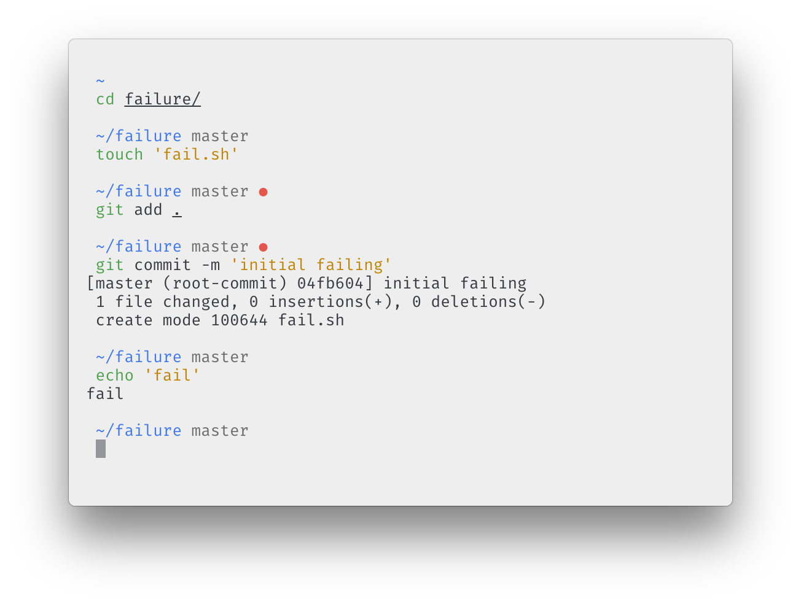

# hyperterm-light

> [Atom One Light][one-light] theme for [HyperTerm][hyperterm]



## Install

Open your HyperTerm preferences and add `hyperterm-light` to plugin list:

```js
plugins: [
  'hyperterm-light'
],
```

## License

MIT

[hyperterm-one-light]: https://github.com/andrepolischuk/hyperterm-one-light
[one-light]: https://github.com/atom/one-light-syntax
[hyperterm]: https://hyperterm.org
